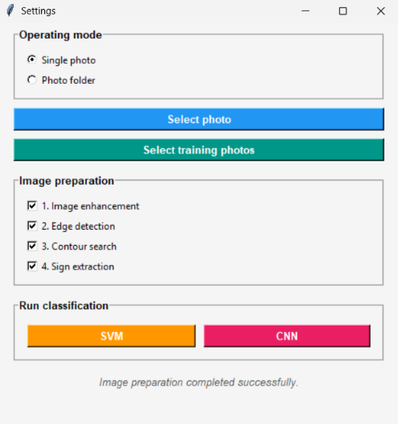
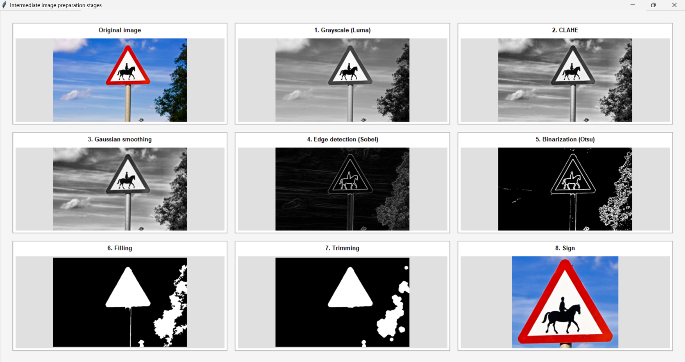
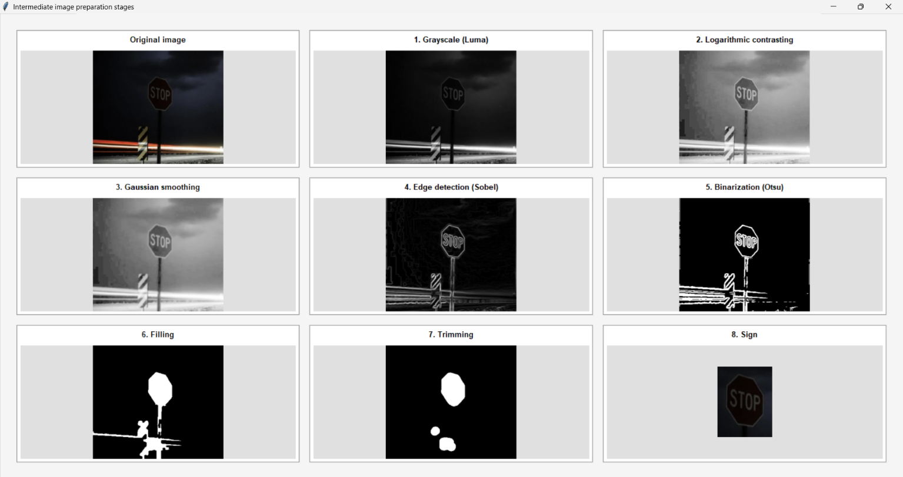
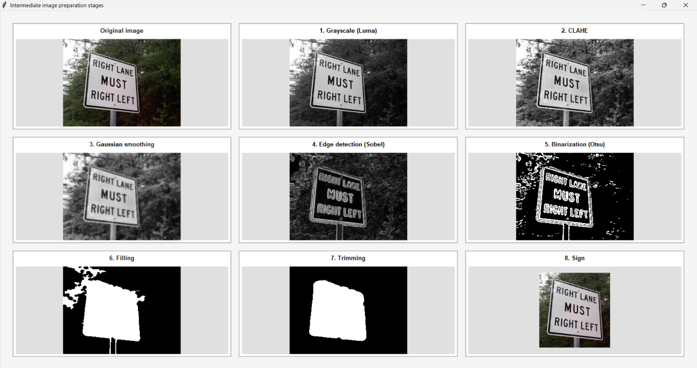
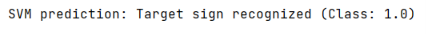
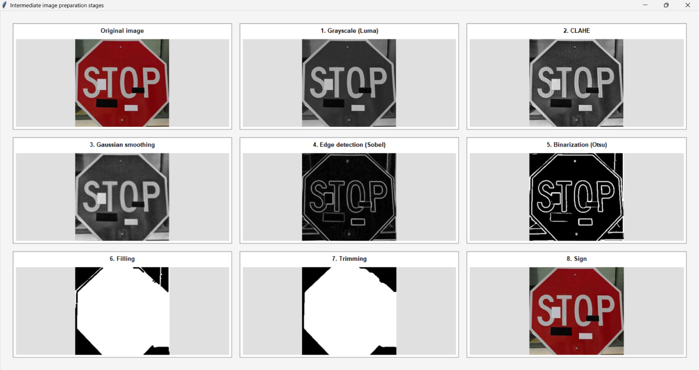

# Intelligent Road Sign Recognition System for Autonomous Transport

This repository contains an end-to-end computer vision project focused on road sign recognition for autonomous vehicles. It detects a target traffic sign (the **STOP** sign) in images, compares a **from-scratch Support Vector Machine (SVM)** built on Hu-moment shape features with a **Convolutional Neural Network (CNN)**, evaluates both under three increasingly difficult test conditions, and wraps everything in an interactive **Tkinter desktop application** that visualizes every preprocessing step.


**Language**  

 
**Data Manipulation**  


 
 **Machine Learning**  


**Image Processing**  


  
**Environment**  


## 📌 Table of Contents

1. [Project Overview](#-project-overview)
2. [Problem Statement](#-problem-statement)
3. [Dataset](#-dataset)
4. [Image Preprocessing Pipeline](#-image-preprocessing-pipeline)
5. [Feature Extraction & Model Implementation](#-feature-extraction--model-implementation)
6. [Experiments & Results](#-experiments--results)
7. [Error Analysis](#-error-analysis)
8. [Practical Impact](#-practical-impact)
9. [Installation & Usage](#-installation--usage)
10. [Repository Structure](#-repository-structure)
11. [Future Improvements](#-future-improvements)

---

## Project Overview

This project was developed as a qualification (diploma) thesis. Its subject of research covers:

- image preprocessing and filtering algorithms,
- mathematical models of binary classification (SVM),
- convolutional neural network (CNN) architectures,
- evaluation metrics and the software tools used to implement them.

Key characteristics of the system:

- **Custom SVM** implemented from scratch with NumPy (SMO-style optimization, RBF kernel) — no scikit-learn or other third-party ML library is used for the classical model.
- **Custom image processing**: Luma conversion, adaptive contrast enhancement (linear / logarithmic / histogram equalization / hand-written CLAHE), Gaussian smoothing and Sobel gradients are all implemented manually. OpenCV is used for thresholding, morphology and contour handling.
- **Hu invariant moments** (computed manually) as shape descriptors, invariant to scale, translation and rotation.
- **CNN** built with TensorFlow / Keras for automatic feature extraction.
- **Interactive GUI** with single-image and whole-folder modes, step-by-step visualization and per-image result reports.

## Problem Statement

Autonomous driving systems must recognize traffic signs reliably under real-world conditions: poor lighting, blur, partial occlusion, tilt, distance from the camera and even vandalism. A missed sign (false negative) is dangerous, a false alarm (false positive) reduces trust in the system.

This project addresses **binary (one-vs-rest) recognition** of one target sign and answers the following questions:

1. How well can classical shape features (Hu moments) combined with an RBF-kernel SVM separate the target sign from other signs?
2. How does classifier quality change as the negative class becomes visually closer to the target and more diverse?
3. How much does a CNN improve on the classical approach under the same conditions?

**Target class:** the **'STOP'** sign (GTSRB class `00014`), chosen because of its characteristic octagonal shape.

## 📂 Dataset

**Source**: the **GTSRB** (German Traffic Sign Recognition Benchmark) dataset. Subsets were assembled manually from it:

| Subset | Folder | Size | Role |
|---|---|---|---|
| Target class (STOP) | `00014` | 780 images | Positive class for training, captured under varying lighting, sharpness and distance |
| Stage 1 negatives | `triangle` | 1,500 images | Triangular signs — different base geometry from the target |
| Stage 2 negatives | `00012` | 2,100 images | "Priority road" (diamond-shaped) — geometrically close to the target |
| Stage 3 negatives | `training set no stop` | 12,361 images | All GTSRB signs that are not class `00014` — maximum visual diversity |
| Test set of target signs | `training set stop` | 155 images | Hand-selected STOP signs preserving variation of conditions |

**Train / test splits**

| Model | Train | Test / Validation |
|---|---|---|
| SVM | 85% | 15% |
| CNN | 75% | 25% |

The CNN split is deliberately lower so that the starting conditions of both algorithms are comparable: with a larger training share the CNN almost always reaches 100% on all metrics.

## Image Preprocessing Pipeline

Implemented in `MainInterface.process_pipeline`. The four GUI checkboxes toggle the stages:

| № | Stage (GUI checkbox) | What it does |
|---|---|---|
| 1 | **Image enhancement** | Luma grayscale conversion (0.299 R + 0.587 G + 0.114 B) followed by **automatic** contrast selection (see below) |
| 2 | **Edge detection** | 5×5 Gaussian smoothing (σ = 1.0) and Sobel gradient magnitude |
| 3 | **Contour search** | Otsu binarization, morphological closing (5×5 ellipse), external contour search, morphological opening (21×21 ellipse), convex hull, bounding-box aspect-ratio filter (0.5 – 1.5) |
| 4 | **Sign extraction** | Selects the largest valid candidate, computes its Hu moments and crops the sign with 15 px padding |



**Adaptive contrast selection** (based on mean brightness and standard deviation of the grayscale image):

| Condition | Method |
|---|---|
| mean brightness < 55 | Logarithmic contrast stretching |
| else, std < 25 | Linear contrast stretching |
| else, std < 45 | Global histogram equalization |
| otherwise | CLAHE (hand-written, 8×8 tiles, clip limit 2.0, bilinear interpolation) |

The **Visualization window** shows all nine intermediate stages (original, luma, contrast, smoothing, Sobel, Otsu, filled mask, opened mask, final crop).





## Feature Extraction & Model Implementation

### Hu invariant moments
`calculate_hu_moments` computes the seven Hu moments directly from the filled contour mask (raw → central → normalized moments). Because their values span many orders of magnitude, they are transformed with a **sign-preserving logarithm** (`-sign(h)·log10|h|`) and then **standardized** (mean/std computed on the training set).

### SVM (from scratch)
| Parameter | Value |
|---|---|
| Kernel | RBF |
| C | 5 |
| gamma | 0.05 |
| max_iter | 2000 |

Modifications of the classical SMO algorithm:
- the first Lagrange multiplier is chosen by checking the Karush–Kuhn–Tucker (KKT) conditions for the current point;
- the second multiplier is chosen with the maximum step-size (max |E_i − E_j|) heuristic;
- the error cache is updated incrementally after each pair update, and the kernel matrix is precomputed once.

### CNN (TensorFlow / Keras)

| Layer | Configuration |
|---|---|
| Input | 30 × 30 × 3, scaled to [0, 1] |
| Conv2D + MaxPooling2D | 32 filters, 3×3, ReLU; pool 2×2 |
| Conv2D + MaxPooling2D | 64 filters, 3×3, ReLU; pool 2×2 |
| Conv2D + MaxPooling2D | 128 filters, 3×3, ReLU; pool 2×2 |
| Flatten → Dense | 128 neurons, ReLU |
| Dropout | 0.5 |
| Dense (logits) → Softmax | 2 classes |

**Training**: Adam optimizer (`learning_rate = 0.001`), `categorical_crossentropy` loss, 5 epochs, batch size 32.

## Experiments & Results

Both models were tested in three stages with a progressively harder negative class. For the SVM, **5 consecutive training runs** were performed at each stage, averages and best values are reported. 

**Metrics**: Accuracy, Precision, Recall, F1-score (computed from TP / FP / FN / TN).

### SVM (Hu moments + RBF kernel)

| Stage | Negative class | Accuracy (avg / best) | Precision (avg / best) | Recall (avg / best) | F1 (avg / best) |
|---|---|---|---|---|---|
| 1 | Triangles (1,500) | 76.92% / 79.91% | 74.19% / 77.61% | 83.92% / 85.95% | 78.75% / 81.57% |
| 2 | Diamonds, class `00012` (2,100) | 69.91% / 74.36% | 65.05% / 70.90% | 82.97% / 86.09% | 72.85% / 76.00% |
| 3 | All other signs (12,361) | 66.49% / 67.52% | 63.89% / 66.44% | 79.24% / 83.47% | 70.69% / 71.43% |

Additional observations:
- False positives grew from **30–37** (stage 1) to **39–58** (stage 2) and **49–63** (stage 3).
- Over the three stages, average Accuracy dropped by about **10 pp** (76.92% → 66.49%), Precision by about **10 pp** (74.19% → 63.89%) and F1 by about **8 pp** (78.75% → 70.69%).
- **Recall stayed stable** (79–84% on average), so the errors lean toward over-triggering on similar shapes rather than missing real STOP signs.

### CNN

| Stage | Result |
|---|---|
| 1 (triangles) | FP = 0, FN = 1 |
| 2 (diamonds) | Accuracy 99.74%, Precision 100.00%, Recall 99.50%, F1 99.75% (FP = 0, FN = 1) |
| 3 (all other signs) | Metrics remain essentially unchanged; errors are limited to isolated samples |

### SVM vs. CNN 

| | SVM (Hu moments) | CNN |
|---|---|---|
| Features | Hand-crafted shape descriptors (7 values) | Learned automatically from pixels |
| Accuracy range | 66–80% | > 99.5% |
| False positives | Tens per stage, growing with difficulty | ≈ 0 |
| Sensitivity to harder negatives | High | Very low |
| Strengths | High recall, interpretable, no heavy ML dependencies | Robust to low light, tilt, distortion, low resolution |

## Error Analysis

Hu moments describe only the **outer contour**, which explains the SVM behavior:

- **Similar shapes confuse the classifier.** Octagons vs. triangles are easy to separate; octagons vs. diamonds are much harder because both fit into a square and have vertical/horizontal axial symmetry. Accuracy fell ~7 pp and Precision ~9 pp between stages 1 and 2.
- **More negative samples results in more noise.** Stage 2 has 600 more negative images than stage 1, which increases noise and complicates the task further.
- **Edge cases.** Strongly tilted, partially occluded or background-blending signs distort the moments, and signs far from the camera lose contour detail due to low resolution.
- **Strengths.** The system copes well with noise, blur, rotation and strong sunlight, and also handled a vandalized sign in the demo.




## Practical Impact

- **Recall-first behavior** of the SVM is desirable in autonomous driving: it is safer to over-detect a STOP sign than to miss one.
- The **CNN** shows near-perfect and stable performance under low light, geometric distortion, tilt and low resolution, which is critical for intelligent transport systems.
- The application doubles as an **educational tool**: every preprocessing stage, intermediate image and metric table is visible to the user.

## Installation & Usage

### Requirements

- Python 3.11+ (with Tkinter, included in most Python distributions)
- `numpy`, `scipy`, `opencv-python`, `pillow`, `tensorflow`

```bash
git clone <your-repository-url>
cd <your-repository-folder>

python -m venv venv
source venv/bin/activate      

pip install numpy scipy opencv-python pillow tensorflow
```

### Prepare the data

Download GTSRB and arrange the training folder like this:

```
training_data/
├── 00014/                    # target class (STOP signs)
└── 00012/                    # negative class 
└── triangle/                 # negative class
└── training set no stop/     # negative class
```

### Run

```bash
python Intelligent traffic sign recognition system.py
```

1. Choose the **mode**: *Single photo* or *Folder with photos*.
2. Click **Select training photos** and choose the training folder (the one containing `00014` and `triangle`).
3. Click **Select photo / Select folder** and choose the data to classify.
4. Toggle the **Image preparation** checkboxes if you want to skip any stage.
5. Click **SVM** or **CNN**. The model is trained automatically on the first run; training progress is shown in the status bar (e.g. `Processing folder 00014: 45.25%...`).

**Outputs**

- *Single photo:* class prediction and metrics table in the console, plus the nine-step visualization window.
- *Folder:* metrics table in the console and a scrollable report window with a preview of each detected sign and its predicted class.

## Repository Structure

```
├── Intelligent traffic sign recognition system.py                 
├── README.md
├── requirements.txt
├── images
└── data 
│   ├──trainning_data
│   │   ├──...    
```

Main components inside `Intelligent traffic sign recognition system.py`:

| Component | Responsibility |
|---|---|
| `SVM` | Custom SMO-based RBF-kernel SVM (`fit`, `predict`, `rbf_kernel`) |
| `MainInterface` | Control panel, preprocessing pipeline, CLAHE, Hu moments, SVM/CNN training and inference |
| `FolderReportWindow` / `CNNFolderReportWindow` | Per-folder classification reports for SVM / CNN |
| `VisualizationWindow` | Step-by-step preprocessing visualization |

## Future Improvements

- **Multi-class classification** instead of binary one-vs-rest, so that the whole spectrum of road signs in an image can be recognized at once.
- **Histogram of Oriented Gradients (HOG)** features for the SVM — they capture local texture and inner content (text, pictograms), which would help separate signs of the same shape, such as speed-limit circles.
- **Performance optimization** because the pure-Python SVM and CLAHE are computationally expensive.
